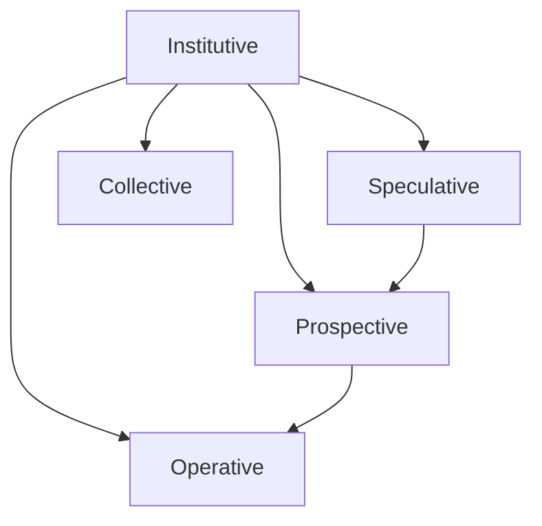

# Jurisdiction

A jurisdiction is a bounded context that establishes a distinct form of engineering responsibility within engineering delivery.

## Jurisdiction and Engineering Delivery

Engineering delivery requires several distinct forms of engineering responsibility.

Jurisdiction establishes the boundaries within which these responsibilities are performed.

These forms are represented by five jurisdiction concepts:

* **Institutive** — establishes platform engineering primitives that support the Amiasea delivery architecture. It conceptually represents the pillars of the platform, specifically the objects and services that establish parts of the institution through which delivery is engineered.
* **Speculative** — stages delivery for development changes by providing capacity to realize and evaluate candidate changes before they enter promotion.
* **Prospective** — stages delivery for approved propositions by establishing the conditions and evidence required before promotion into operation.
* **Operative** — stages delivery into its accepted operating realization and maintains that realization as the promoted result.
* **Collective** — establishes hosting capabilities for the hosting model that serve the collective set of environments and solutions rather than one particular realization.

Speculative, Prospective, and Operative therefore form the primary **delivery-promotion jurisdictions**. They describe distinct responsibilities through which delivery is realized, evaluated, validated, and promoted toward operation.

Institutive is different in kind. It establishes the platform engineering primitives through which the delivery architecture itself is supported.

Collective is also different from the delivery-promotion jurisdictions. It establishes capabilities for the hosting model that transcend an individual realization.

These are not necessarily sequential lifecycle stages. They identify distinct engineering responsibilities that may exist simultaneously within the same engineering delivery model.

Infrastructure-as-code is used to realize these responsibilities. The resulting infrastructure is therefore not merely cloud infrastructure; it is infrastructure through which the engineering model, delivery architecture, and hosting model are established and operated.

## Institutive

Institutive represents the platform engineering primitives that establish and support the Amiasea delivery architecture.

It conceptually represents the pillars of the platform, while remaining concerned specifically with the objects and services that establish parts of the institution through which delivery is engineered.

Institutive primitives may include capabilities for:

* engineering identity and SSO;
* engineering teams and groups;
* GitHub organization-level structures;
* HCP Terraform organization-level structures;
* cloud-vendor engineering structures;
* engineering identities and delegated access;
* engineering credentials and secrets;
* platform-level automation;
* control-plane capabilities; and
* other foundational services required by the delivery architecture.

An object or service is Institutive according to its purpose, not according to the provider through which it is realized.

For example, engineering SSO may be provided by an identity platform, engineering teams may be represented in GitHub or HCP Terraform, and cloud-hosting vendor structures may establish engineering authority within a provider.

These systems may all participate in Institutive without sharing an infrastructure boundary.

```text id="q7w4jc"
Institutive
├── Identity and SSO
├── Engineering teams
├── GitHub
├── HCP Terraform
├── Cloud-vendor engineering structures
├── Engineering credentials and secrets
└── Platform automation
```

An Institutive infrastructure boundary is therefore provider-specific only in its realization.

For example, `inception/institution` may establish an `amiasea-institutive` boundary in Azure and an equivalent Institutive boundary in AWS or another cloud provider.

The provider-specific boundary does not redefine Institutive. Azure may realize the boundary through a subscription, while AWS may realize it through an account or another organizational construct.

These are different infrastructure mechanisms expressing the same higher-level engineering responsibility.

Likewise, `amiasea-institutive` is not the Institutive boundary. It is one Azure boundary in which some Institutive primitives are realized.

The `inception/institution` workspace establishes only the Institutive infrastructure modeled within that workspace. It does not comprehensively instantiate all Institutive primitives across the delivery architecture.

> **Institutive establishes the platform engineering primitives through which the Amiasea delivery architecture is made possible, regardless of the infrastructure boundary used to realize them.**

## Delivery-Promotion Jurisdictions

Speculative, Prospective, and Operative form the primary **delivery-promotion jurisdictions**.

### Speculative

Speculative stages development changes for evaluation.

It provides maintained capacity in which candidate changes can be realized and evaluated before entering promotion.

A speculative environment may receive an ephemeral realization of a development change without becoming owned by that change.

### Prospective

Prospective stages delivery for approved propositions.

It establishes the conditions and evidence required to determine whether an approved proposition is suitable for promotion into operation.

A prospective environment therefore provides a validation context for a selected proposition rather than a temporary context for continuously changing development.

### Operative

Operative stages delivery into its accepted operating realization.

It establishes and maintains the realization of a delivery artifact after promotion.

The operative realization is maintained independently of speculative and prospective evaluation.

> **Speculative evaluates development changes; Prospective validates approved propositions; Operative maintains promoted delivery.**

## Collective

Collective establishes hosting capabilities for the collective hosting model rather than for one particular realization.

A Collective capability may serve multiple environments, solutions, or applications.

Its purpose is therefore different from a capability established specifically for an individual environment.

Collective capabilities may include shared hosting services, platform capabilities, or other resources whose responsibility transcends a particular speculative, prospective, or operative realization.

A capability being consumed by multiple environments does not by itself make it Collective. It belongs to the Collective jurisdiction when the capability itself is established for the collective hosting model.

> **Collective establishes capabilities for the collective hosting model rather than for one particular realization.**

## Jurisdiction and Environment

A jurisdiction establishes the engineering responsibility and boundary within which environments are realized.

An environment provides the concrete hosting context through which that responsibility becomes usable by delivery.

```text id="7u2g9a"
Jurisdiction
    │
    └── Environment
        └── Hosting capabilities
```

For Strata, Speculative, Prospective, Operative, and Collective jurisdictions establish the applicable hosting contexts for delivery.

The environment provides the concrete boundary through which the jurisdiction's responsibility is realized.

A jurisdiction may therefore contain multiple environments without the environments becoming the jurisdiction itself.

The physical boundary used to realize an environment is determined by the hosting model.

For Strata, an Azure subscription may realize a jurisdiction while its resource groups realize individual environments.

Other hosting models or cloud providers may realize the same jurisdictional concept through different infrastructure boundaries.

## Jurisdiction and the Engineering Model

Jurisdictions provide clear boundaries through which the engineering model can be realized.

The boundary is meaningful because it identifies what form of engineering responsibility applies within it.

A cloud subscription, account, resource group, cluster, Terraform workspace, repository, or other infrastructure construct may realize part of a jurisdiction without defining the jurisdiction itself.

The same jurisdiction concept may therefore be realized differently across cloud vendors or delivery work streams.

> **Jurisdiction establishes the boundary of an engineering responsibility; infrastructure provides the mechanisms through which that responsibility is realized.**

## Infrastructure-as-Code

Infrastructure-as-code is one mechanism through which jurisdictional responsibilities are realized.

The resulting infrastructure is therefore not merely cloud infrastructure.

It is infrastructure through which the delivery architecture, hosting model, and engineering responsibilities are established and operated.

Different work streams may use different infrastructure mechanisms to realize the same jurisdictional concepts.

The ontology remains stable while its realization varies.

## Relationships



The relationships express responsibilities within engineering delivery rather than requiring a particular infrastructure topology.

They do not imply that all delivery work streams implement the jurisdictions as a single sequential pipeline.
