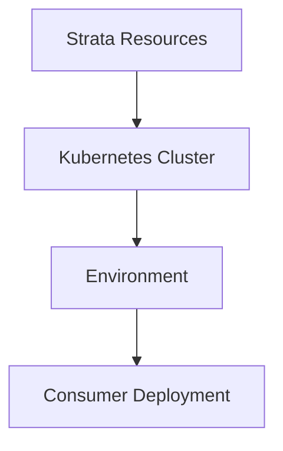
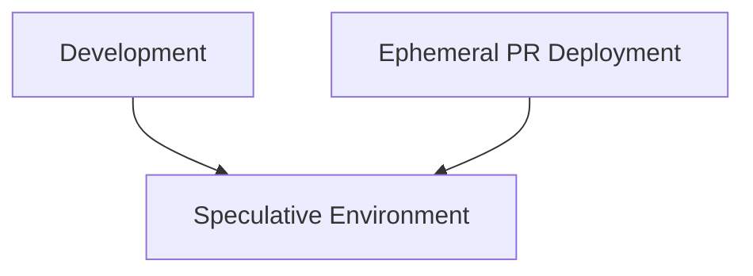
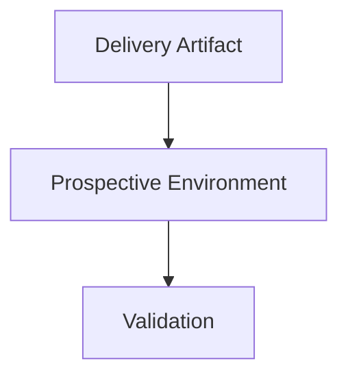
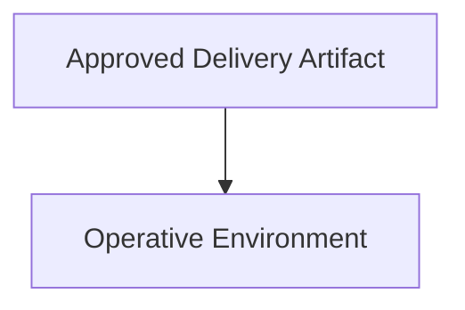
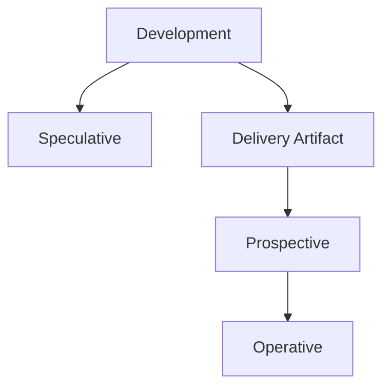

# Environment

An environment is a bounded context in which a solution is hosted, realized, evaluated, or made operative.

For Strata, the environment establishes the hosting context and the environmental characteristics within which Strata capabilities are provided and consumed.

> **The environment establishes the context; the consumer targets the hosting capability within it.**

## Hosting Context

An environment establishes the hosting context available to its consumers without requiring them to establish or understand the infrastructure behind it.

For Strata, the primary hosting target is a **Kubernetes cluster**.

A Strata environment may identify a particular Kubernetes cluster and provide the information required for an authorized consumer to deploy into it.

The cluster may depend upon Strata resources including:

* substrate;
* identity integration;
* networking;
* centralized services; and
* other capabilities.

Those resources establish the hosting capability but are not themselves the environment.



The semantic hosting model remains Kubernetes regardless of the cloud provider or implementation used to establish the cluster.

## Environment State

An environment has both **shape** and **data**.

### Shape

Shape describes the configuration and composition of the capabilities and resources realized within the environment.

Shape may include:

* infrastructure;
* applications and services;
* networking;
* identity;
* policy;
* configuration;
* supporting services; and
* other capabilities required by the solution.

The shape of an environment may be reconciled independently from its data.

### Data

Data describes the information state available within the environment.

Data may include:

* persistent application state;
* databases;
* configuration state;
* test fixtures;
* reference data; and
* other state required by the environment.

Two environments may have the same shape while having materially different data.

> **An environment is defined by both what is realized within it and the state it contains.**

## Consumer Use

A consumer uses the hosting environment according to the applicable hosting contract.

The environment provides the concrete context required to target the established hosting capability. The consumer depends upon that capability without assuming ownership of the resources that establish it.

An environment may host multiple deployments over its lifecycle. A deployment does not necessarily establish a new environment.

## Environment Ownership

An environment is a maintained system rather than an incidental product of delivery.

Environment ownership includes responsibility for:

* establishing the environment;
* maintaining its baseline;
* managing its data characteristics;
* establishing isolation and access boundaries;
* maintaining supporting capabilities; and
* ensuring that the environment remains suitable for its intended purpose.

Delivery and promotion consume environments but do not define their existence.

## Speculative Environment

A speculative environment provides a maintained context in which changes under development can be temporarily realized and evaluated.

Speculative environments are independent of individual pull requests. A pull request does not create or own the environment in which it is evaluated.

Instead, an ephemeral deployment representing the pull request is temporarily introduced into an existing speculative environment.



When the ephemeral deployment is removed, the environment remains available for subsequent speculative evaluation.

The speculative environment therefore has a lifecycle independent from the lifecycle of any particular pull request.

### Speculative Environment Pool

Speculative environments may be maintained as a curated pool.

The pool provides capacity for concurrent speculative evaluations without requiring a complete environment to be established for every pull request.

Pool size is an environmental capacity decision rather than a semantic property of a delivery artifact.

The selection of an environment for a speculative deployment may consider:

* current allocations;
* environment capabilities;
* data characteristics;
* isolation requirements;
* relationships between changes;
* available capacity; and
* other constraints established by the environment owner.

The allocation mechanism is separate from the semantic definition of the speculative environment.

### Speculative Baseline

A speculative environment is maintained against the development baseline.

The baseline represents the shape established by the state committed to the development branch.

An ephemeral pull-request deployment temporarily introduces the proposed change into that environment. The pull-request deployment does not redefine the environment's baseline.

After the ephemeral deployment is removed, the environment is reconciled so that it is again suitable for subsequent speculative evaluation.

The environment therefore remains a maintained realization of the development baseline while individual pull requests temporarily diverge from that baseline.

### Environment and Ephemeral Deployment

The distinction between environment and deployment is fundamental to speculative evaluation.

```text
Environment
    ├── persistent environmental characteristics
    ├── baseline shape
    ├── baseline data
    └── ephemeral PR realization
```

The environment persists. The deployment may not.

An ephemeral deployment must not assume ownership of environment state that belongs to the environment itself.

## Prospective Environment

The prospective environment provides the context in which a selected delivery artifact is validated before promotion.

Prospective evaluation is associated with an explicitly selected delivery artifact rather than the continuously changing development state.



The prospective environment may have the same or substantially similar shape as another environment while maintaining different data or other environmental characteristics.

The purpose of the prospective environment is to establish evidence concerning whether the selected delivery artifact is suitable for promotion.

The prospective environment is therefore a **validation context for a selected artifact**, rather than a temporary environment created for an individual development change.

## Operative Environment

The operative environment is the environment in which an approved delivery artifact is made available for use.

The operative environment is maintained independently of speculative and prospective evaluation.



The operative environment represents the currently accepted realization of the solution.

Changes to development do not directly alter the operative environment.

Promotion establishes when a validated delivery artifact becomes the operative realization.

## Environment Relationships

Speculative, prospective, and operative environments serve different purposes.

They are not necessarily replicas of one another and do not need to use the same physical realization mechanism.



**Speculative** provides a maintained context for evaluating development changes.

**Prospective** provides a maintained context for validating a selected delivery artifact.

**Operative** provides the context in which an approved artifact is made available.

The environments may differ in:

* shape;
* data;
* scale;
* isolation;
* access;
* hosting implementation; and
* operational characteristics.

Their semantic relationship is established by their purpose within delivery and promotion rather than by requiring them to be physical copies of one another.

## Environment Realization

The mechanism used to establish and maintain an environment depends upon the requirements of the solution and its hosting context.

Strata does not require speculative, prospective, and operative environments to use the same realization mechanism.

For example, a solution whose primary runtime is Kubernetes may use cluster-native mechanisms for speculative realization, while a solution spanning a broader cloud footprint may require a different mechanism for introducing and removing ephemeral changes.

The semantic requirements of the environment remain stable even when its physical realization differs.

> **Strata defines the environmental purpose and boundaries; the hosting context determines how those requirements are realized.**

## Environment Boundary

An environment boundary should correspond to a meaningful distinction in lifecycle, isolation, policy, data, governance, hosting, or operational responsibility.

A cloud subscription, resource group, Kubernetes cluster, namespace, account, or other infrastructure boundary does not automatically constitute an environment.

Those constructs may establish or participate in an environment without determining its semantic identity.

## Environmental Independence

An environment should have a lifecycle that can be reasoned about independently from the individual products or delivery artifacts that consume it.

Its physical realization and baseline may change as the platform evolves, but the environment should not become merely a disposable container for a particular deployment.

This allows environments to be curated as durable platform capabilities while delivery artifacts and ephemeral deployments move through them.

> **An environment is a maintained context, not an incidental stage in a release process.**
