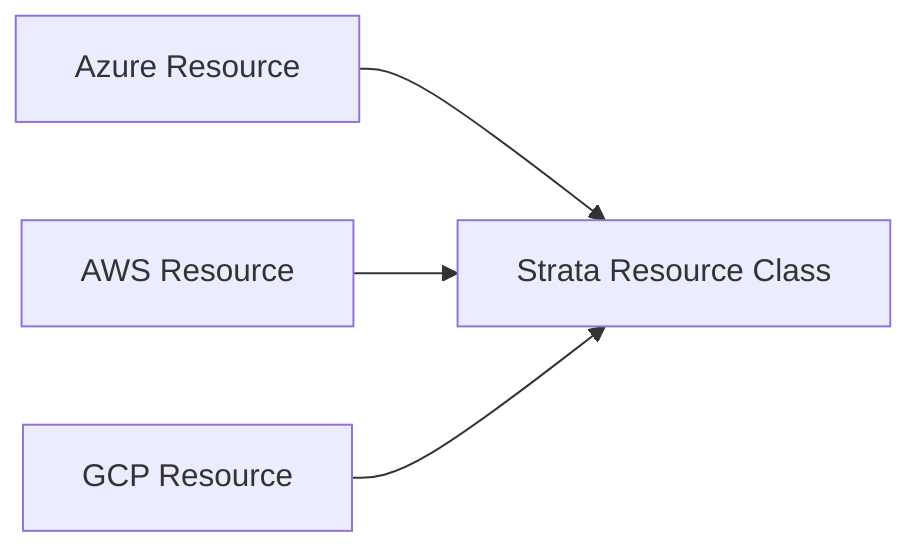
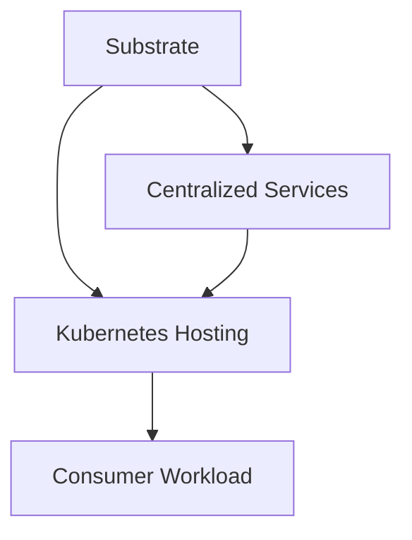
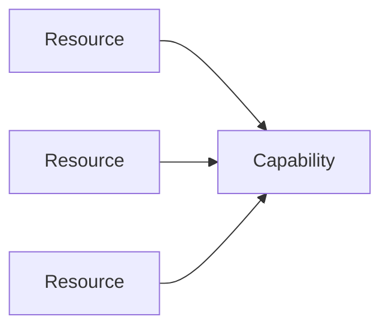

# Strata Ontology

The Strata ontology defines the semantic concepts that describe the hosting domain established by Strata.

It provides a vocabulary for describing what Strata recognizes, establishes, and makes available to consumers without reproducing the implementation details used to realize those concepts.

# Resources

A Strata resource is a semantic object recognized by the Strata Resource Model.

The Resource Model provides the vocabulary used by the Strata catalog, resource graph, and hosting model. It describes resources by their meaning within Strata rather than by the technology used to implement them.

> **A Strata resource is a recognized hosting-domain concept, not a Terraform or vendor resource.**

## Resource Classes

A **resource class** is a named semantic category recognized by the Resource Model. It answers:

> **What kind of thing is this in the Strata domain?**

The model is intentionally minimal. It establishes semantic identity without reproducing provider schemas, configuration properties, or implementation details.

Examples include:

* Network
* Subnet
* API Management
* Key Management
* Kubernetes

Resource classes must represent meaningful Strata concepts rather than broad infrastructure categories. For example, `Storage` is too broad because different storage implementations may have different purposes, consumers, lifecycles, and jurisdictions.

Resource classes are therefore **opinionated by design**.

## Resource Instances

A resource class describes a kind of resource. A **resource instance** represents an occurrence of that class in a Strata instance.

```text
Resource Class
    Network

Resource Instances
    development-network
    production-network
```

The resource graph describes the identity, attributes, and relationships of instances. The Resource Model describes what those instances mean.

> **The Resource Model defines the semantic class; the graph describes its instances.**

## Vendor Independence

The Resource Model is independent of vendor-specific resource naming and configuration.

Native provider resources may differ substantially while establishing the same Strata resource class:



Provider-specific mappings determine which native resources establish a Strata resource class without importing provider schemas into the Resource Model.

Terraform and native provider APIs remain implementation mechanisms. They do not need to correspond one-to-one with Strata resources.

> **The implementation establishes infrastructure; the Resource Model establishes its Strata meaning.**

## Jurisdiction

The Resource Model defines what Strata can recognize. Jurisdiction determines whether a particular instance belongs to Strata.

Recognition as a resource class does not mean every instance of that class belongs to Strata. Jurisdiction depends on the resource's purpose, capability, consumers, lifecycle, and relationship to the hosting model.

> **The Resource Model defines what a thing means. Jurisdiction determines whether Strata owns the concern.**

## Scope

The Resource Model has an intentionally bounded scope. It is not a universal infrastructure ontology or a catalog of every provider resource.

It contains the meaningful concepts necessary to describe the supported Strata hosting domain while excluding provider-specific constructs, arbitrary low-level infrastructure objects, implementation details without independent Strata meaning, and concerns belonging to other domains.

The same resource classes should be usable across providers. An Azure and AWS Strata graph should use the same semantic classes whenever their infrastructure establishes the same Strata concept.

> **Strata models the hosting concepts it has chosen to establish, not every infrastructure shape that can exist.**

# Substrate

Strata substrate is the foundational infrastructure upon which its hosting and centralized capabilities are established.

It provides the structural conditions required by those capabilities but is not itself a workload hosting model.

> **Substrate establishes the foundation on which Strata capabilities operate.**

## What Constitutes Substrate

Substrate represents foundational resources required to establish the supported hosting model.

Examples include:

* networks;
* subnets;
* foundational connectivity;
* foundational routing; and
* other infrastructure establishing the hosting foundation.

The specific provider resources used to establish substrate are implementation details, not the semantic definition of substrate.

## Substrate Is Not Infrastructure in General

Strata operates on an established infrastructure platform that provides the physical and virtualization machinery required to provision resources.

That machinery is outside the Strata model.

Strata does not manage:

* physical servers;
* physical disks;
* physical routers and switches;
* hypervisors;
* data-center infrastructure; or
* equivalent provider-managed infrastructure.

A **Network** or **Subnet**, for example, may be a Strata resource even though the physical and virtualization infrastructure that realizes it is not.

> **Strata governs the foundational resources it establishes on the infrastructure platform, not the machinery that makes those resources possible.**

## Substrate and Other Capabilities

Substrate establishes conditions upon which other Strata capabilities depend.



Centralized services and Kubernetes hosting contexts may depend upon substrate resources without those resources becoming part of their semantic definitions.

## Scope

Substrate is limited to foundational capabilities that are part of the supported Strata hosting model.

> **Strata substrate establishes the foundation of the hosting model, not every foundational resource that happens to exist.**

# Capabilities

A Strata capability is a meaningful outcome established by one or more Strata resources and made available to consumers of the hosting model.

> **Resources establish capabilities; capabilities are what consumers rely upon.**

## Capability Identity

A capability describes **what Strata makes possible**, rather than how it is implemented.

For example, Kubernetes resources may establish a capability to host workloads according to the supported Kubernetes model.

Capabilities should be expressible without provider-specific resource names or implementation schemas.

## Resources and Capabilities

A resource answers:

> **What Strata resource exists?**

A capability answers:

> **What does it establish for its consumers?**

A capability may depend upon multiple resources, and a resource may contribute to multiple capabilities.



Capabilities may also compose other capabilities. A hosting capability, for example, may depend upon network, identity, and observability capabilities without absorbing them into a single concept.

## Capability Scope

A capability belongs within Strata when it establishes a concern of the supported hosting model.

Examples include:

* networking required for hosting;
* workload identity;
* API management;
* runtime hosting;
* deployment;
* observability; and
* centralized platform services.

A capability is not within Strata merely because it is shared or technically useful. It must represent a concern Strata intentionally establishes as part of its hosting model.

## Consumer Perspective

Capabilities exist in relation to their consumers. Consumers should be able to reason about a capability without understanding the resources that implement it.

How a capability is exposed, secured, observed, versioned, and retired belongs to its implementation and lifecycle rather than its semantic identity.

## Scope of the Model

The capability model is not a catalog of provider services. A provider service may have no Strata representation, while a Strata capability may require multiple provider services to establish.

> **Strata defines the capabilities it chooses to establish, not every capability that infrastructure can provide.**

# Centralized Services

A Strata centralized service is a service that Strata intentionally establishes, configures, and governs as a shared service for multiple consumers.

A centralized service may provide one or more capabilities, but the service and its capabilities remain distinct concepts.

> **A centralized service is a governed shared service; its capabilities are what consumers consume.**

## What Constitutes a Centralized Service

A service is appropriate for centralization when one appropriately governed instance can serve multiple consumers and Strata should own its establishment, lifecycle, configuration, or access.

Examples may include:

* API Management;
* identity and authentication;
* observability;
* policy and integration services;
* text-to-speech;
* translation;
* image recognition;
* AI query or inference; and
* document processing.

The category is not defined by technology. The determining question is whether Strata is establishing and governing the shared service as part of its hosting model.

## Consumer Integration

A centralized service may require consumer-specific configuration, such as:

* credentials or API keys;
* authorization grants;
* service or webhook registrations;
* endpoints or subscriptions; and
* access policies.

This does not transfer ownership of the service to the consumer.

> **Consumer-specific configuration does not make a shared service consumer-owned.**

## Provider Services

A provider service consumed by Strata is not necessarily a Strata centralized service.

If Strata merely permits consumers to use a provider-managed service, the service remains outside Strata's jurisdiction.

If Strata establishes, configures, governs, and exposes a shared service to multiple consumers, it may constitute a Strata centralized service.

> **Consumption does not imply jurisdiction. Establishment and governance do.**

## Scope

Centralization is an architectural and governance decision, not merely a decision to share infrastructure.

A service should not be centralized merely because it is convenient to share, difficult to configure, or technically provisionable by Strata.

Product functionality, product data, and product-specific services remain outside Strata even when shared by multiple products.

> **Centralization is justified by shared service governance, not shared consumption alone.**
