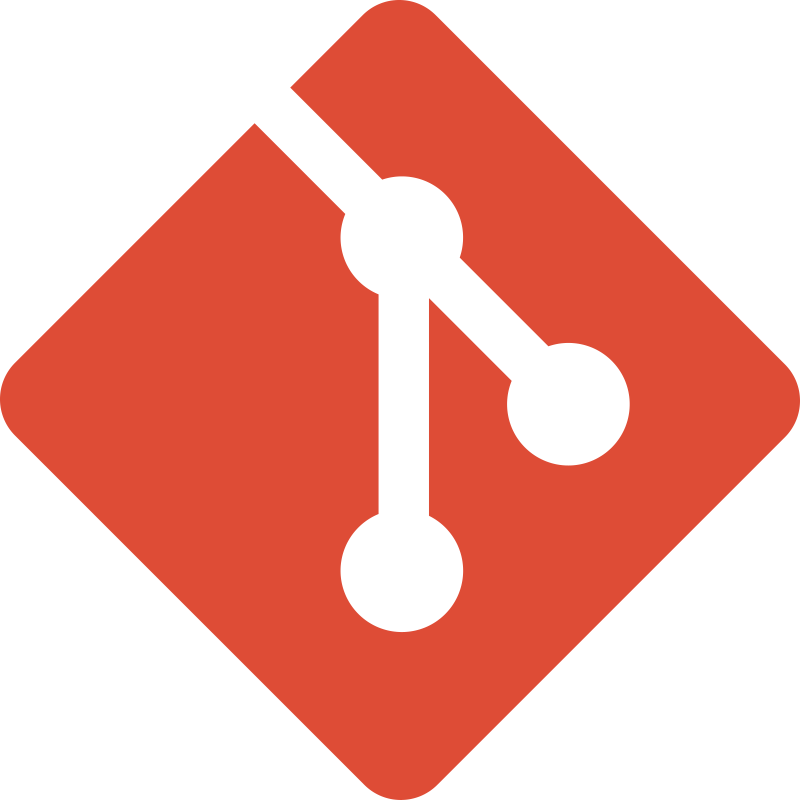

# Amiasea Enterprise Structure

### Global Assets
*  amiasea.com
*  amiasea
*  /  amiasea

---

### (Azure - GitHub - HCP) Resources

*  GitHub
    *  amiasea/.github (Enterprise Base + Project Factory)
        * &nbsp;&nbsp;└─>  amiasea/[project-name]
            *  HCL Config / HCP (Modules - Stacks - Deployments)
*  Azure

    

    

    

     amiasea
    

    *  rg-amiasea
        *  amiasea.com
            *  [app-name][-env].amiasea.com *

    

    

     amiasea-dev
    

    *  rg-amiasea-dev
        *  uami-amiasea-dev /  app-oidc-amiasea-dev
        *  front-door-dev
        *  amiaseaciamdev.onmicrosoft.com   ( amiaseaciamdev.ciamlogin.com / auth.dev.amiasea.com )
            *  app-[app-name]-dev *
        *  sql-dev
    

    

    

     amiasea-prod
    

    *  rg-amiasea-prod
        *  uami-amiasea-prod /  app-oidc-amiasea-prod
        *  front-door-prod
        *  amiaseaciam.onmicrosoft.com   ( amiaseaciam.ciamlogin.com / auth.amiasea.com )
            *  app-[app-name]-prod *
        *  sql-prod
    

    

    

### Notes *

<i>It is not possible to logically group all of the resources with their corresponding ceremony and structural grouping.</i>

The OIDC SP is used to setup the Application Resources per environment including the app-[app-name]-[env] and the UAMI SP is used for inter-resource access.

The app-[app-name]-[env] is created for the corresponding Application Resources.

The [app-name][-env].amiasea.com DNS Zone Record is included in the Application Resources Terraform HCL.

### Project Standard Resources
*  amiasea-[env]
    *  rg-[app-name]-[env]
        *  db-[app-name]-[env]

        Team
        GitHub Repo
        GitHub Project
        HCP Project
        HCP Workspace
        Resource Group

### Notes *

Amiasea has a small Workforce Tenant, but it is primarily a CIAM based External ID consumer based environment.

Products live within the Amiasea umbrella. CIAM provides consumer SSO across all products.

While the project level resources are in their own resource group by environment, they link to the Microsoft Graph API / Entra ID CIAM Tenant.

